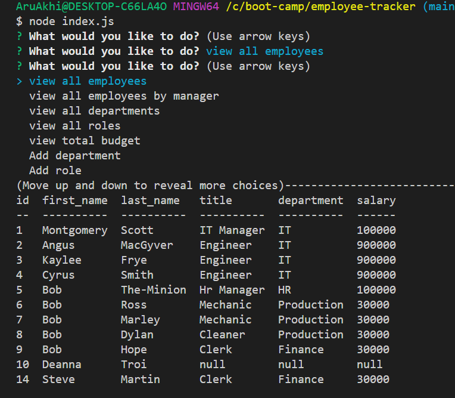
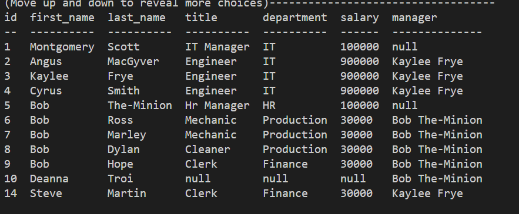
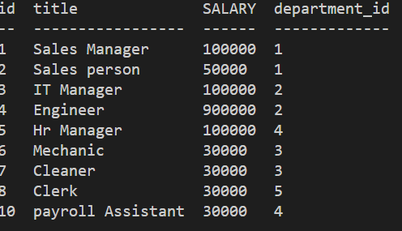
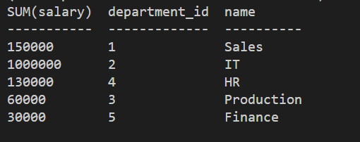
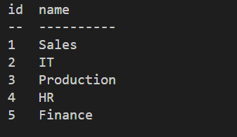

# employee-tracker

## USER STORY
```
As a business owner
I want to be able to view and manage the departments, roles, and employees in my company
So that I can organize and plan my business
```

## Acceptance criteria
Build a command-line application that at a minimum allows the user to:

  * Add departments, roles, employees

  * View departments, roles, employees

  * Update employee roles

Bonus points if you're able to:

  * Update employee managers

  * View employees by manager

  * Delete departments, roles, and employees

  * View the total utilized budget of a department -- ie the combined salaries of all employees in that department

## Application usage
The user of this command line application has option to view, update, delete and add employee roles, employee and departments.

## TECHNOLOGIES used
* NODEJS
* INQUIRER
* MYSQL
* SQL FOR QUERIES
* JAVASCRIPT
* DOTENV for storing the environment variables

## MOCKUP
The following images shows the mockup of this application




<br>


## VIDEO LINK

Please view the following video to know how the app works!
[video url](https://drive.google.com/file/d/13ycG_Xe-pIvivGpooBUZpdzZQJeTu1qO/view)
